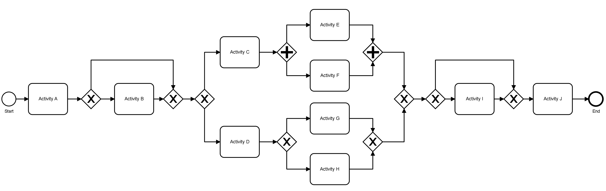

# AgentSimulator (adapted)

## Description
The repository provides an adapted version of the original repository ([https://github.com/lukaskirchdorfer/AgentSimulator](https://github.com/lukaskirchdorfer/AgentSimulator)) that supplements the paper:
"Kirchdorfer, Lukas, et al. "AgentSimulator: An Agent-based Approach for Data-driven Business Process Simulation." 2024 6th International Conference on Process Mining (ICPM). IEEE, 2024."

The objective of this adapted repository is to simulate event logs based on specific scenarios for use in a different project (*Steady-State Detection v2*).
The original repository has been modified for this purpose and **should not** be used for any other purposes.

### Scenarios
All scenario configuration files are stored as `experiment_1_config_{id}.yaml` (with `id` ranging from 1 to 20) in the folder `raw_data/experiment_1_settings/`.
All other parameters required for the simulation are extracted from the generated event log `exepriment_1_bimp_log.csv`(also located in `raw_data/experiment_1_settings/`) and saved in the file `simulation_parameters_original_bimp.pkl` for reuse in later simulations to reduce processing time.
The event log `exepriment_1_bimp_log.csv` is obtained using online process simulator [BIMP](https://bimp.cs.ut.ee/simulator).
The used setting for BIMP are stored in the file `experiment_1_model_settings.bpmn`.
The figure below shows the control-flow of the used model.

The obtained original event log form BIMP (called `exepriment_1_bimp_log_origianl.csv`) is transformed to the log `exepriment_1_bimp_log.csv` using the script `transform_event_log.py`.
This script removes artificial events and renames column names.

### Scenario types
Two types of scenarios are simulated in this repository:
- Changes in the arrival rate (scenarios 1-10).
- Changes in the number of available resources (scenarios 11-20).

### Scenario type parameters
1. The following parameters can be specified for the scenario type `"arrivals"`:

- **rate_schedule** (*list of int*): Defines the relative arrival rates. For example, `[1, 2]` means there are two fixed arrival rates, with the second being twice as high as the first. Similarly, `[1, 2, 3]` specifies three fixed arrival rates, where the second and third rates are 2 and 3 times higher than the first, respectively.  
  The order of the list determines the sequence in which the different arrival rates appear in the event log.  
  In general, any combination of integers can be used to define the rate changes.

2. The following parameters can be specified for the scenario type `"agent_availability"`:

- **agents_in_SS** (*list of int*): Defines the number of available resources (agents) in steady states.  
  For example:
  - `[10]` → A constant steady state with 10 available resources throughout the simulation.
  - `[5, 10]` → Initially, 5 resources are available, followed by a transition period where the number of resources linearly increases from 5 to 10. After the transition, the simulation continues with 10 resources until the end.

The simulation code ensures that the durations of steady states and the durations of transitions between them are equal.  
All transitions between steady-state values follow a **linear** progression.

### General simulation parameters
- **start_time** (*str*): Start time of the simulation (e.g., `"2025-01-01T00:00:00Z"`).
- **end_time** (*str*): End time of the simulation (e.g., `"2026-12-31T23:59:59Z"`).
- **N** (*int*): Total number of traces to be simulated.
- **duration_distribution**: specifies default task duration for all activities. (uniform between 5 and 10 hours)

## How to use

### Prerequisites
To execute the code, you need to :
- create an environment, e.g., `conda create -n myenv python=3.9`
- install the dependencies in `requirements.txt`, e.g., with `pip install -r requirements.txt`

Note, you may need to excute `export LD_LIBRARY_PATH=$CONDA_PREFIX/lib:$LD_LIBRARY_PATH` before running the python script `simulate.py`

### How to run the AgentSimulator
To run the script simulate.py you need to specify the following parameters (from the project root folder):

`python simulate.py --log_path raw_data/experiment_1_settings/experiment_1_bimp_log.csv --case_id case_id --activity_name activity --resource_name resource --end_timestamp end_time --start_timestamp start_time --num_simulations 10 --central_orchestration --num_cores=10`

where:

`--log_path`: path to the entire log which you need to store in the folder raw_data

`--case_id`: name of the case_id column

`--activity_name`: name of the activity column

`--resource_name`: name of the resource column

`--end_timestamp`: name of the end timestamp column

`--start_timestamp`: name of the start timestamp column

`--central_orchestration`: True or False (whether handovers are centrally orchestrated or autonomous)

## Output

The all simulated event logs are stored in the folder:
`AgentSimulator\simulated_data\experiment_1_bimp_log\orchestrated\simulated_log_{scenario_id}_{simulation_id}.xes`

In total 200 event logs: 20 scenarios and 10 logs per scenario.
